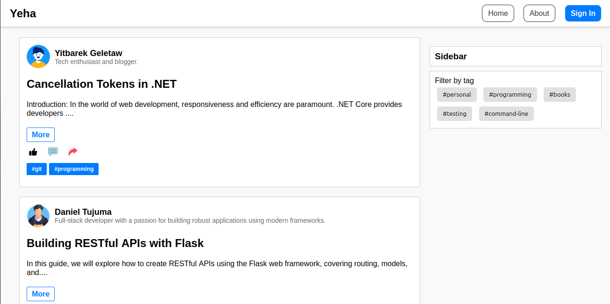

# Yeha Blog Platform

Welcome to **Yeha**, a modern, open-source blogging platform designed to let your voice be heard. Whether you're a passionate writer, a casual blogger, or someone looking to share ideas, Yeha makes it easy to connect with your audience. 🚀

## 🌐 Live Demo and Author Info
- **Live Demo**: [coming soon](https://github.com/bush-da/Yeha)
- **Project Blog**: [Final Project Article](https://your-blog-article.com)
- **Author(s)**: [LinkedIn Profile](https://www.linkedin.com/in/daniel-tujuma-702454271)

---
## 📸Screenshots
Here's a glimpse of the project in action:
## Screenshots



## 📖 Introduction

Yeha is a full-featured blogging platform developed with a modern stack of technologies, focusing on ease of use and scalability. Its main features include user authentication, blog post creation, tagging, content management, and post engagement through likes.

The system allows users to create engaging content, categorize it with tags, and interact with posts through a flexible and intuitive user interface. Whether you're a tech enthusiast or a lifestyle blogger, Yeha is built to empower your creativity.

## 🛠️ Installation

Getting Yeha up and running on your local environment is simple! Follow these steps:

### Prerequisites
- Python 3.8+
- MySQL or SQLite
- Flask

### Steps
1. **Clone the Repository**
   ```bash
   git clone https://github.com/your-repo/yeha-blog.git
   cd yeha-blog
   ```

2. **Create a Virtual Environment**
   ```bash
   python3 -m venv venv
   source venv/bin/activate
   ```

3. **Install Dependencies**
   ```bash
   pip install -r requirements.txt
   ```

4. **Set up Database**
   Update your `config.py` with your database credentials and run:
   ```bash
   flask db upgrade
   ```

5. **Run the App**
   ```bash
   flask run
   ```

   Now visit `http://127.0.0.1:5000` in your browser.

---

## 🚀 Usage

Yeha is simple yet powerful. Here are the key features you can explore:

- **Create a Blog Post**: Write articles with a full-featured text editor and publish them to the world.
- **Tagging System**: Add tags to your posts, helping readers discover content related to their interests.
- **User Profiles**: Customize your profile with a bio, profile picture, and social links.
- **Post Engagement**: Track likes on posts and follow user activity.
- **Search and Browse**: Browse content by tags, search for articles, and explore trending topics.

---

## 🤝 Contributing

We love collaboration! If you'd like to contribute to Yeha, please follow these steps:

1. Fork the repository.
2. Create a feature branch (`git checkout -b new-feature`).
3. Commit your changes (`git commit -m 'Add some feature'`).
4. Push to the branch (`git push origin new-feature`).
5. Open a Pull Request.

We also encourage issue reporting, feature requests, and suggestions for improving Yeha. Let's build something awesome together!

---

## 🌟 Related Projects

Looking for more open-source projects? Check out these cool projects:

- [Jekyll](https://github.com/jekyll/jekyll) - Simple, blog-aware static site generator for personal, project, or organization sites.
- [Ghost](https://github.com/TryGhost/Ghost) - Professional publishing platform.
- [Flask-Blog](https://github.com/miguelgrinberg/microblog) - A Flask-based blog tutorial project.

---

## 📝 License

This project is licensed under the MIT License - see the [LICENSE](LICENSE) file for details.

---

👋 Thank you for checking out Yeha. We hope you enjoy using the platform as much as we enjoyed building it! Feel free to star the project and share your thoughts. 😊
